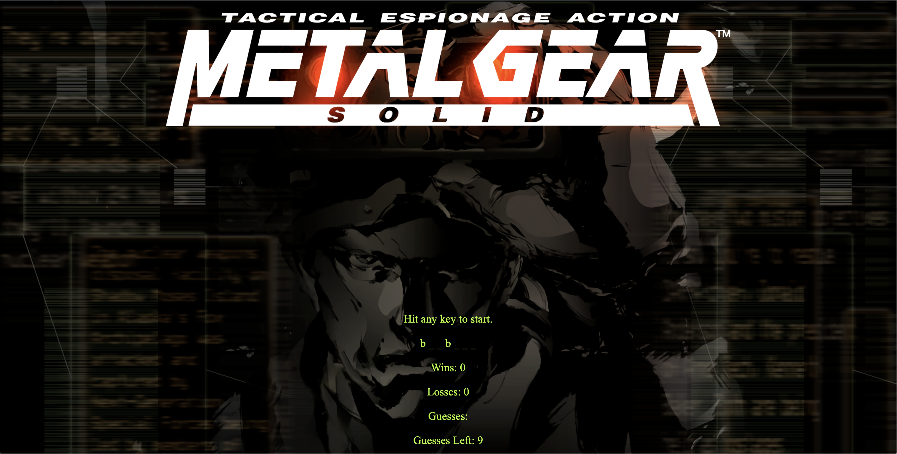

# Hangman-Game

I made a hangman game based on the Metal Gear Solid Playstatin video game. I reasearched google and used class work as reference in order to find the proper functions to get the game in working order. The game gives you 9 guess to type a letter and see if it appears in the word selected from the gameWords array at random. Good luck on your mission soldier.

Mission Objectives:

- Press any letter to make a guess and have the letter lines ( __ ) appear.
- You will have 9 guesses to decode the word or the mission is over. 
- Once you complete one word (or fail), the game will reset and another word will appear.

Deployed Link: https://ataranto320.github.io/Hangman-Game/

Lnaguages:

- HTML5
- CSS
- JavaScript